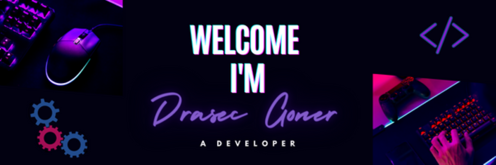

<h1 align="center">I'm a Developer and Student</h1>

Skills: JAVA / PYTHON / JS / HTML / CSS

- 🔭 I’m currently working on this page. 
- 🤔 I’m looking for help with a thing called 'Life❤️‍🩹' 
- 💬 Ask me about my Favourite Game 
- 😄 Pronouns: He/Him
- ⚡ Fun Fact: I like watching anime but doesn't have Time to.. 🤣

<h2> Skills  </h2>

    

 

  

  

  
